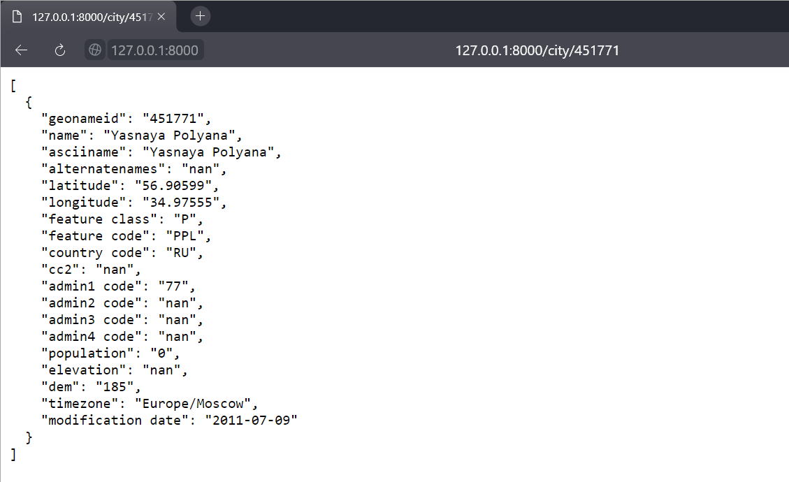
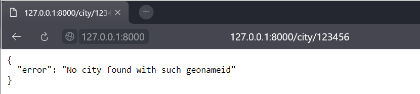
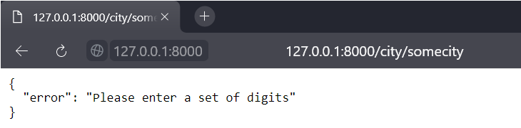
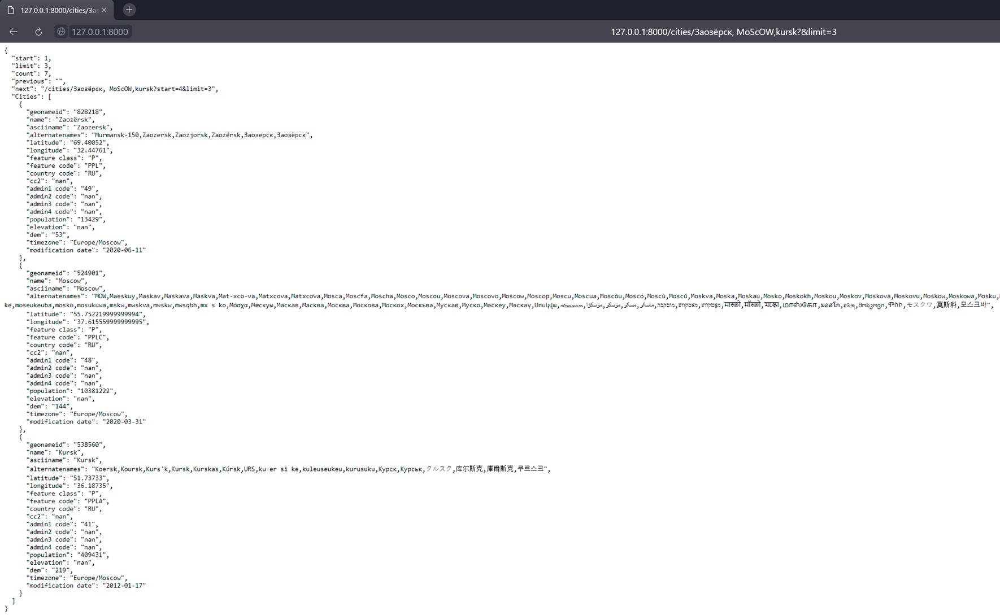
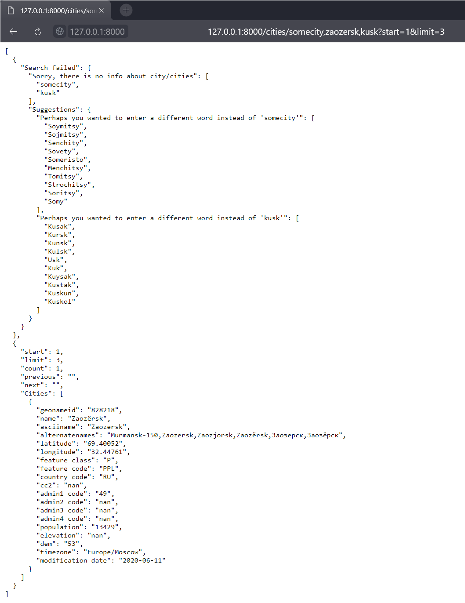
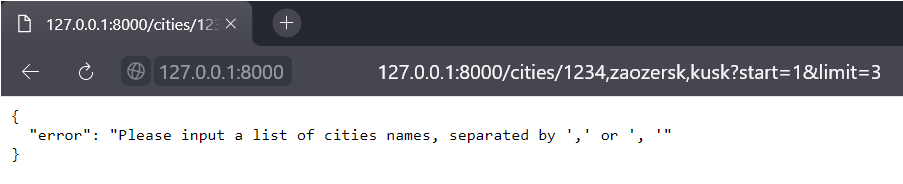
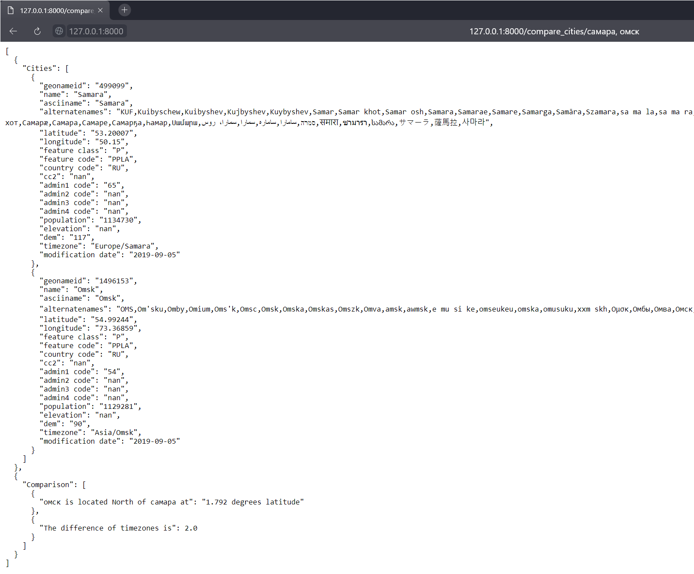
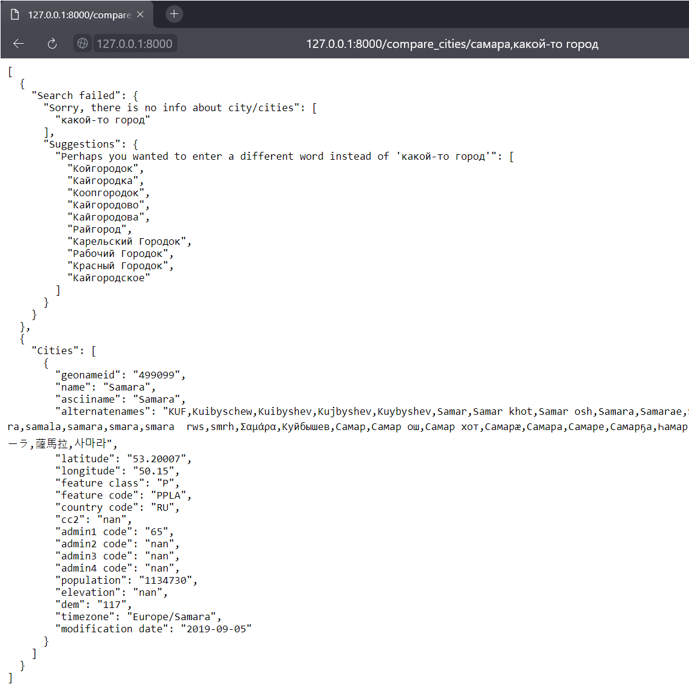
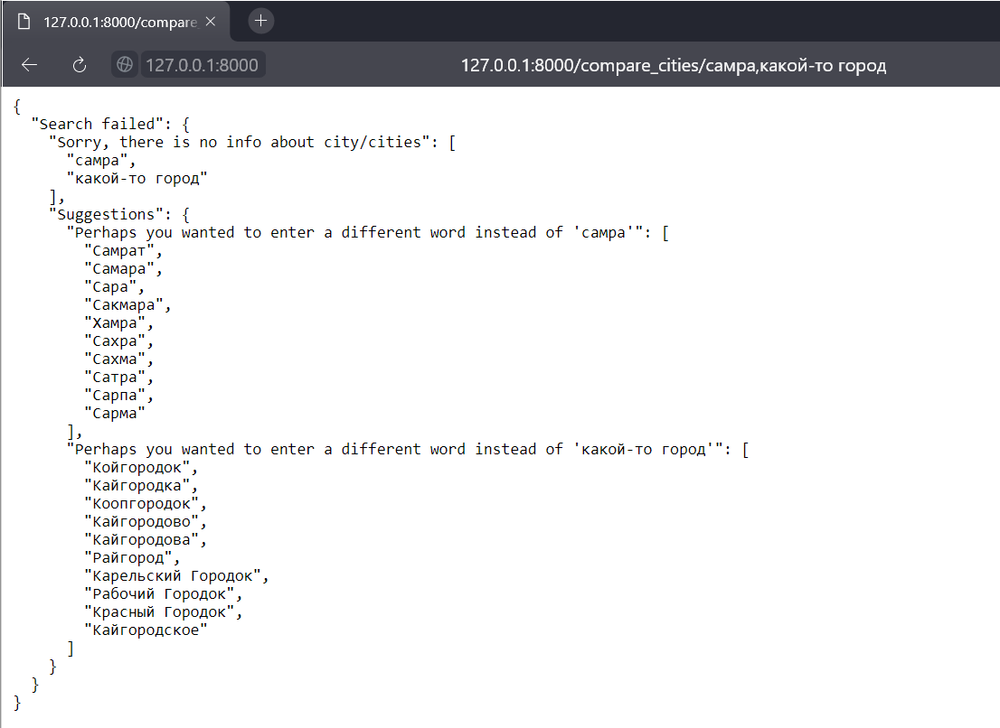

Test task for an Intern for the position «Analyst (python)»
===

### Table of contents
* [Task Description](#task-description)
* [Methods description](#methods-description)
    * [Method '`get_city_info`'](#method-get_city_info)
    * [Method '`get_cities_info`'](#method-get_cities_info)
    * [Method '`compare_cities`'](#method-compare_cities)
* [Used tools](#used-tools)

### Task Description

The project is an implemented HTTP server for providing information on geographical objects in Russia. The data is taken from the geographical database «Geonames». The implemented server provides a REST API service.

### Methods description

#### Method get_city_info
The method takes the '`geonameid`' as input and returns information about the city.

To call the method, pass the string  '`/city/geonameid`',

where '`geonameid`' is an integer corresponding to a unique ID of a certain city.

*Example of usage:*

In this case, the '`geonameid`' that exists in the database was passed, and the output is a '`json`' object with information about this city.

*Example of usage:*

If you pass a set of digits that doesn't match any '`geonameid`' from the database, we will get an error message with this test.

*Example of incorrect usage:*

Received an error message indicating that for correct work you need to pass an integer.

#### Method get_cities_info

The method takes the page and the number of cities  displayed on the page and returns a list of cities with their information.

To call the method, pass the string '`/cities/city_1_name,city_2_name,...,city_n_name?start=integer_number&limit=integer_number`', where '`city_1_name,city_2_name,...,city_n_name`' are the names of the cities you want to find, '`start`' is a parameter that takes number from which cities from the list of cities should be displayed on the page from and '`limit`' is a parameter that takes number of cities from a list of cities you want to see on the page.

'`city_1_name,city_2_name,...,city_n_name`' can be written in Russian or English, and the names may contain the characters '`«'», « », «-»`' and shoud be separated by '`«,» or «, »`'

'`start`' is an optioanal parameter with default value `1`, that takes integer number.

'`limit`' is an optioanal parameter with default value `5`, that takes integer number.

*Example of usage:*

In this case, we are looking for cities '`Заозёрск, MoScOW,kursk`', note that method ignores the case of the inputted string and returns all cities that contains such names in there '`name, asiiname or alternatenames`' characteristics of this city in database.

'`start`' - is missed here as it is an optioanal parameter with default value `1`. 
And '`limit`' we have clearly indicated here as '`3`'.

In '`json`' object returned by method we can see parameters:
'`start`', '`limit`', '`count`', '`previous`', '`next`', '`Cities`'.

+ '`start`' - It is the position from which we want the data to be returned.
+ '`limit`' - It is the max number of items to return from that position.
+ '`count`' - It is the total count of results.
+ '`previous`' - It is the url for the previous page of the query assuming current value of limit.
+ '`next`' - It is the url for the next page of the query assuming current value of limit.
+ '`Cities`' - This is the list of results whose position lies within the bounds specified by the request. The order in which cities are displayed corresponds to the order in which they appear in the url. In the example above, all the cities '`Заозёрск`' will be displayed first, then '`Moscow`' and then '`Kursk`'.

*Example of usage:*

In this case, we are looking for cities '`somecity,zaozersk,kusk`'.
'`start`' and '`limit`' we have clearly indicated here as '`1`' and '`3`' respectively.

You may notice that a new '`Search failed`' component has been added. It is displayed when one or more cities with such names from the URL were not found. It also shows which specific cities that were not found in the '`Sorry, there is no info about city/cities`' parameter. And in the '`Suggestions`' parameter, we can see possible variants of cities that were meant instead of erroneous ones.

*Example of incorrect usage:*

Received an error message indicating that for correct work you need to pass a list of cities names separated by '`«,» or «, »`.

#### Method compare_cities

The method takes the names of two cities (in russian) and returns information about the cities found, as well as additional information: which one is located to the North and whether they have the different time zone and how much they differed (when several cities have the same name, resolves ambiguity by choosing a city with a large population; if the population matches, takes the first one that comes across)

To call the method, pass the string
'`/compare_cities/city_1_name,city_2_name`',

where '`city_1_name,city_2_name`' are the names of the cities (in russian) you want to find. Names may contain the characters '`«'», « », «-»`' and shoud be separated by '`«,» or «, »`'

*Example of usage:*

In this case, we are looking for cities '`самара, омск`', note that method ignores the case of the inputted string and returns all cities that contains such names in there '`name, asiiname or alternatenames`' characteristics of this city in database.

And the output is a '`json`' object with information about these cities in '`Cities`' section.

You may notice that a new '`Comparison`' component has been added, which shows an additional information: 
*   which city is North and how much, 
*   whether timezones different and how much.

*Example of usage:*

In this case, we are looking for cities '`самара,какой-то город`'.

As in method `compare_cities`', new component '`Search failed`' has been added. It happened because there is no city with name '`какой-то город`'.

The output is a '`json`' object with informationabout city '`самара`' is in '`Cities`' section because this city that contains in database.

And the '`Comparison`' component has not been added, because we don't have city to compare with.

*Example of usage:*

In this case, we are looking for cities '`самра,какой-то город`'.

Now the same thing happened as in the example above, except that there is no '`Cities`' section now, since none of the cities '`самра,какой-то город`' were found in the database.

### Used tools
    Flask - for server creation
    Flask Restful - for REST API realisation
    Pandas - for working with data
    Pytz - for determining timezones 
    Datetime - for calculating difference between timezones
    Difflib - for creating suggestions
    Re - for working with regex
    Json - for json packaging
    Markdown - for converting to html